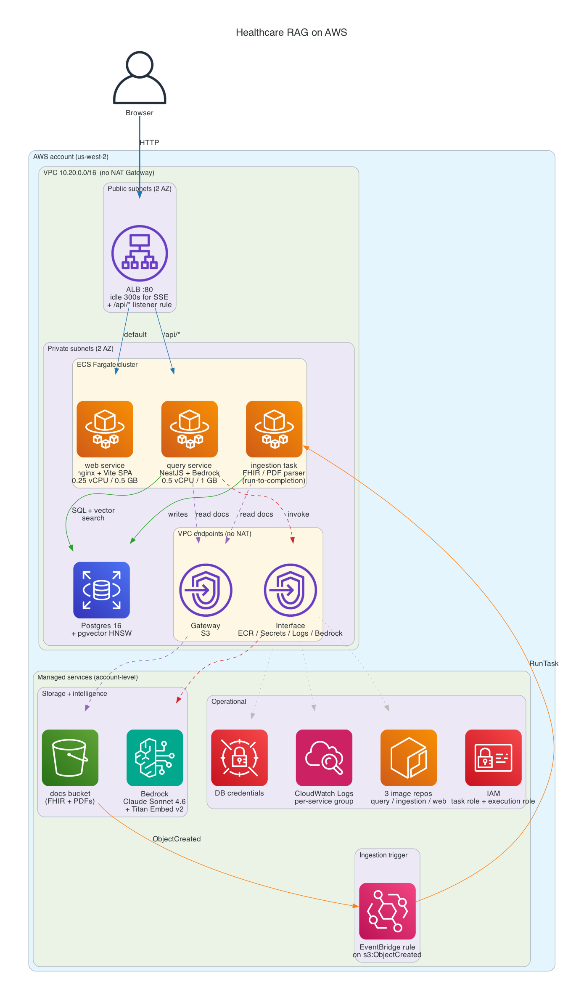

# Healthcare RAG on AWS

Patient-scoped clinical Q&A over synthetic EHR data, built with an agentic RAG architecture and deployed to AWS.

Ask questions about one patient at a time ("What conditions has this patient been diagnosed with?", "Any drug-allergy contraindications?") and get answers grounded in their actual records, not a generic medical knowledge base. The model decides which data to fetch through tool-use, combining SQL queries over structured data with vector search over clinical notes.

This is the follow-up to [onepiece-rag](https://github.com/codeanding/onepiece-rag): same RAG architecture, but pointed at data where a wrong answer actually matters.

> The data is 100% synthetic, generated with [Synthea](https://github.com/synthetichealth/synthea). No real patient information is used anywhere.

## Architecture



- **API**: NestJS running an agentic loop over Amazon Bedrock (Claude Sonnet 4.6). Seven tools back the model: `get_conditions`, `get_medications`, `get_labs`, `get_allergies`, `get_encounters`, `get_immunizations`, and `search_notes`.
- **Retrieval**: hybrid. Structured data (encounters, labs, medications) is queried with SQL. Clinical notes are embedded with Titan Embed v2 and searched via pgvector (HNSW index).
- **Frontend**: React + Vite, streaming responses over Server-Sent Events.
- **Infrastructure**: Terraform. VPC with no NAT Gateway (VPC endpoints instead), ECS Fargate, RDS Postgres 16, an ALB with path-based routing, and an EventBridge-triggered ingestion pipeline.

## Repo structure

```
apps/
  api/              NestJS API: agentic query loop, tools, ingestion
  web/              React + Vite streaming frontend
packages/
  shared/           Types shared between api and web
infra/              Terraform modules + deploy script (see infra/README.md)
docs/               Architecture diagrams + deployment screenshots
SPEC.md             Technical spec
```

## Local development

Prerequisites: Node 22, pnpm 10, Docker, and an AWS account with Amazon Bedrock model access (for the LLM and embedding calls).

```bash
pnpm install
cp .env.example .env            # fill in AWS credentials + Bedrock model IDs

# Start Postgres (pgvector) + API via docker compose
pnpm dev

# Apply the schema
pnpm --filter api prisma:migrate

# Ingest synthetic patients (generate Synthea bundles first, see SPEC.md)
pnpm --filter api ingest:synthea

# Frontend (separate terminal)
pnpm dev:web
```

The app runs at `http://localhost:5173`, the API at `http://localhost:3000`.

## Deploy to AWS

The full deploy is a single script with a deploy-once-validate-destroy workflow:

```bash
./infra/deploy.sh all       # bootstrap -> apply -> push -> migrate -> smoke
./infra/deploy.sh destroy   # tear everything down
```

It creates real AWS resources and costs money while running (~$0.12/hr). See [infra/README.md](infra/README.md) for the full runbook, cost breakdown, and prerequisites.

## Blog posts

1. Patient-scoped clinical RAG with Bedrock Converse *(link coming soon)*
2. Deploying a clinical RAG to AWS with Terraform *(link coming soon)*

## License

MIT
